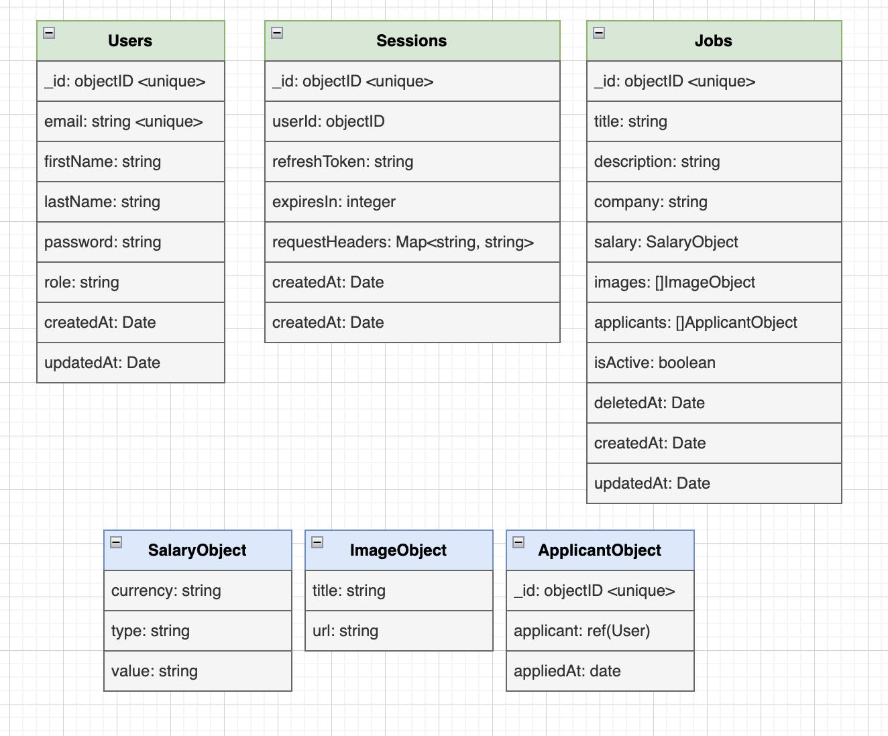
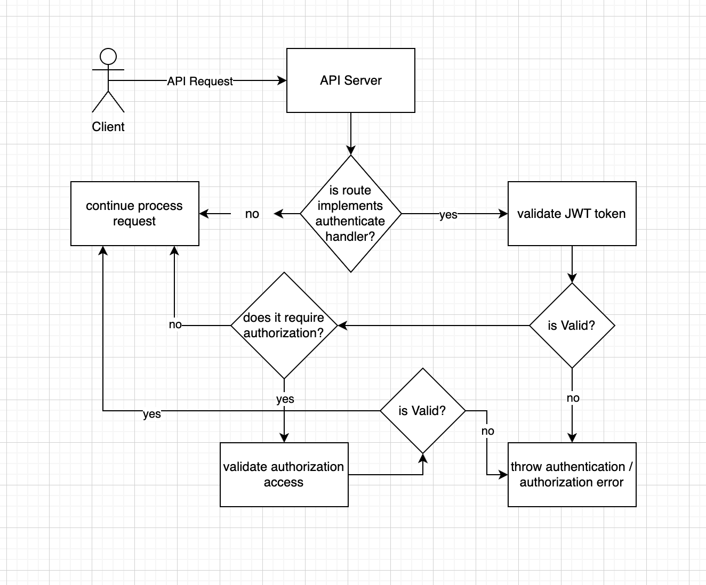

# Job Portal

This project is created to showcase how to build a simple job portal REST API NodeJS backend using techstack such as expressjs, MongoDB (using mongoose) written in TypeScript.

## Pre-requisites
* Install NodeJS v16.0.0 or above
* Install npx globally

## Getting started
```shell
npm install -g npx
```
* Install dependencies (using yarn)
```shell
cd <job-portal-api>
yarn install
```
* Or npm
```shell
cd <job-portal-api>
npm install
```
* Copy `.env.example` to `.env`
```shell
cp .env.example .env
```

* modify the `.env` file to add `DB_STRING`. At this point, you can create your own free MongoDB (https://account.mongodb.com/account/login) or use mine (can be found on the credentials.txt inside the archive)

* Build and run the project (using ts-node)
```shell
yarn dev
```

Navigate to http://localhost:3000

API Document endpoints

Swagger UI endpoint: http://localhost:3000/swagger/api-docs or the live version: https://jobs.iksandi.com/swagger/api-docs/

GitHub repository: https://github.com/lojaya/job-portal

Example admin user
```
email: iksandi@lojaya.com
password: 12345678
```

Example normal user 
```
email: iksandi@lojaya.co
password: 12345678
```

## Project Structure
The folder structure of this app is explained below:

| Name | Description |
| ------------------------ | --------------------------------------------------------------------------------------------- |
| **app**                  | Contains source code                               |
| **app/middlewares**      | Express middlewares which process the incoming requests before handling them down to the routes
| **app/models**           | Models define mongo schemas that will be used in storing and retrieving data from Application database  |
| **app/repositories**     | Repositories define layer between usecases and database access. 
| **app/routes**           | Contain all express routes, separated by domain of application                       
| **app/usecases**         | Usecases define param validation & handler functions to serve various express routes. 
| **app/utils**            | Common utilities to be used across the app.  
| **app**/app.config.js    | Application configuration including environment-specific configs |
| **app**/app.ts           | Contains all express middlewares uses and setup      |
| **app**/db.ts            | Mongodb singleton using mongoose                                                         |
| **app**/server.ts        | Entry point to express app                                                               |
| **app**/types.d.ts       | Generic interface and types used accross app                                                 |
| **node_modules**         | Contains all  npm dependencies   |
| **dist**                 | Contains the distributable (or output) from TypeScript build.  |
| **uploads**              | Folder for uploaded images                                                               |
| .editorconfig            | My standard editor (IDE) configs
| .env                     | ENV configs
| .eslintrc.js             | Config settings for linting source code 
| .prettierrc.json         | Config settings for prettier code formatter
| package.json             | Contains npm dependencies as well as [build scripts](#what-if-a-library-isnt-on-definitelytyped)   
| swagger.json             | API collection in a form of JSON, used by swagger-ui to automatically generate API documentation |
| tsconfig.eslint.json     | Config settings for TSLint code style checking                                                |
| tsconfig.json            | Config settings for compiling source code written in TypeScript    


## Building the project
### Running the build
All the different build steps are orchestrated via [npm scripts](https://docs.npmjs.com/misc/scripts).
Npm scripts basically allow us to call (and chain) terminal commands via npm.

| Npm Script | Description |
| ------------------------- | ------------------------------------- |
| `start`                   | Runs node on dist/server.js |
| `build`                   | Build the app using tsc and emit it to dist folder |
| `dev`                     | Runs dev using ts-node |
| `typecheck`               | Runs tsc on project files without emit to check any code errors |
| `lint`                    | Runs eslint on project files to lint the app source code |
| `prettier`                | Runs prettier on project files to check code format errors |


# Architecture
Below is some information of the app architecture.

## ERD

The database for this project is using mongodb. I create three collections to store `users`, `jobs`, and `sessions` data. Job collection has `applicants` field which is an array of object containing `appliedDate` and `applicant` (reference to User collection).

SalaryObject and ImageObject is a more sophisticated data structure so that we can:
* Salary: input salary currency, type (fixed, ranged, equity), and its nominal value
* Image: input image title/alt text and url


## Authentication & Authorization
Authentication done using JWT. Client will get the JWT token as well as refresh token upon hitting `/api/signin` API endpoint. the JWT access token itself only lived for **10 minutes** (can be changed in the .env config file) after creation while refresh token ttl is **24 hours** (can be changed in the .env config file).

Authorization done by attaching `role` attribute on the user model. It is a simple RBAC implementation where user role type is only **User** and **Admin**.

Below is the illustration of authentication/authorization process


## Logging
Logging the application client requests is done using morgan library. Currently its being implemented in a minimal fashion, the logs will be created at `app/access.log`. Later this can be incorporate into existing logging collection frameworks such as ELK stacks.

## Parameter Validations
The parameter validation is done by using `fastest-validator` (wrapped by `fastest-express-validator` library). It validates not only body request payload and query param, but also request parameter.

## Security
The password is being hashed using bcrypt with 12 character salt string. 

## Application Features
Based on the user stories:
1. [x] Create a nodejs app for a job portal app apis.
2. [x] Design a database schema for the following user stories
    * [x] As a user I should be able to create an account with email, first name, last name and a secure password.
    * [x] As a user I should be able to login with the account I created.
    * [x] As a user I should be able to list all the jobs on the platform.
    * [x] As a user I should be able to view more details of a selected job.
    * [x] As a user I should be able to apply for the selected job.
    * [x] As a user I should be able to view all the jobs I applied for.
    * [x] As a user I should be able to view my profile details.
    * [x] As an admin user I should be able to add a job with title, description, image, active, posted at, company, salary to the platform.
    * [x] As an admin user I should be able to list all the jobs.
    * [x] As an admin user I should be able to delete a job.
3. [x] Create rest apis for the above user stories.
4. [x] Secure the rest apis that needed to be secured. 5. Setup swagger documentation for the rest apis.
5. [x] Use: express js with typescript and mongodb.

Additionally, some other extra features developed such as:

- As an **anonymous** I should be able to list all the jobs on the platform.
- As a user I should be able to update my account with email, first name, last name.
- As a user I should be able to change my password.
- As a user I should be able to completely remove my account.
- As a user I should be able to destroy my refresh session.
- As a user I should be able to refresh my access token.
- As a user I should be able to upload image.
- As a user I should be able to filter job list with status (active/inactive).
- As a user I should be able to filter job list that i haven't applied yet.
- As an admin I should be able to update the job info.
- As an admin I should be able to view all archived jobs (deletedAt != null).

## API Documentation
The API document is generated and showed using swagger-api at http://localhost:3000/swagger/api-docs

I am using `swagger-ui-express` library to automatically represent my API collection into a beautiful UI. The swagger file can be found on the root project `swagger.json`